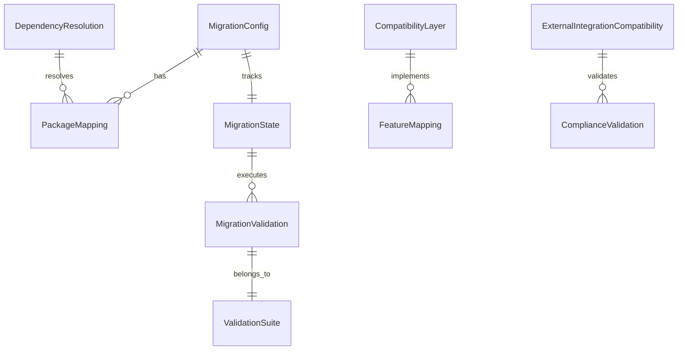

# Data Model: Directory-Based Nuxt 3 to Nuxt 4 Migration

## Directory Migration Entity

**Purpose**: Manages the blue-green directory copy migration process from source to target directories.

```typescript
interface DirectoryMigration {
  id: string
  sourceDirectory: string // "/home/mateu/NuxtsProjects/v9planesN3Bui3"
  targetDirectory: string // "/home/mateu/NuxtsProjects/v9PLANESN4BUI4"
  status: 'preparing' | 'copying' | 'migrating' | 'testing' | 'completed' | 'rolled-back'

  // Migration steps
  steps: {
    backup: boolean
    directoryCopy: boolean
    nuxtUpgrade: boolean
    testing: boolean
    validation: boolean
  }

  // Database continuity
  databaseConnection: {
    shared: boolean // True - both directories use same MongoDB
    connectionString: string
    backupCreated: boolean
  }

  // File mappings for directory structure changes
  fileMappings: FileMapping[]

  createdAt: Date
  startedAt?: Date
  completedAt?: Date
}

interface FileMapping {
  sourcePath: string // Relative to source directory
  targetPath: string // Relative to target directory
  action: 'copy' | 'move' | 'transform' | 'skip'
  nuxt4Compatibility: boolean
  transformFunction?: string // Name of transformation function
}
```

## Migration Configuration Entity

**Purpose**: Central configuration for managing the migration process and compatibility settings.

```typescript
interface MigrationConfig {
  id: string
  version: string // Target Nuxt version (e.g., "4.0.0")
  status: 'pending' | 'in-progress' | 'completed' | 'rolled-back'
  compatibilityMode: boolean // Enable legacy compatibility features

  // Directory-specific configuration
  directoryMigration: DirectoryMigration

  featureFlags: {
    useNitroV3: boolean
    enableWASM: boolean
    enhancedTypeCheck: boolean
    zeroDowntime: boolean
  }

  packageMappings: PackageMapping[]
  createdAt: Date
  completedAt?: Date
}

interface PackageMapping {
  packageName: string
  currentVersion: string
  targetVersion: string
  compatibilityShim: boolean
  migrationStrategy: 'upgrade' | 'replace' | 'shim'
}
```

## Compatibility Layer Entity

**Purpose**: Temporary adapters bridging Nuxt 3 patterns with Nuxt 4 requirements.

```typescript
interface CompatibilityLayer {
  id: string
  name: string
  type: 'config' | 'component' | 'composable' | 'api-route'
  deprecatedPattern: string
  nuxt4Pattern: string
  shimCode?: string
  autoMigrate: boolean
  priority: 'high' | 'medium' | 'low'
}

interface ConfigCompatibility extends CompatibilityLayer {
  oldPath: string
  newPath: string
  transformFunction?: string
}

interface ComponentCompatibility extends CompatibilityLayer {
  componentPath: string
  propsChange?: {
    oldProps: string[]
    newProps: string[]
    mapping: Record<string, string>
  }
}
```

## Dependency Resolution Entity

**Purpose**: Process for identifying and resolving package version conflicts.

```typescript
interface DependencyResolution {
  id: string
  packageName: string
  conflictType: 'version' | 'api' | 'deprecated'
  severity: 'critical' | 'warning' | 'info'
  resolution: {
    strategy: 'upgrade' | 'downgrade' | 'shim' | 'replace'
    actionItems: string[]
    estimatedEffort: number // hours
  }
  dependencies: string[] // Packages that depend on this one
  resolved: boolean
  resolvedAt?: Date
}

interface ResolutionPlan {
  id: string
  dependencies: DependencyResolution[]
  totalEstimatedEffort: number
  executionOrder: string[] // Dependency IDs in resolution order
  rollbackPlan: string
}
```

## Feature Mapping Entity

**Purpose**: Correspondence between deprecated Nuxt 3 features and their Nuxt 4 equivalents.

```typescript
interface FeatureMapping {
  id: string
  featureName: string
  category: 'config' | 'api' | 'routing' | 'rendering' | 'build'
  nuxt3Pattern: string
  nuxt4Pattern: string
  migrationComplexity: 'simple' | 'moderate' | 'complex'
  autoMigrate: boolean
  codemodAvailable: boolean
  examples: {
    before: string
    after: string
  }[]
}

interface BreakingChange {
  id: string
  featureName: string
  description: string
  impact: 'critical' | 'high' | 'medium' | 'low'
  affectedComponents: string[]
  migrationSteps: string[]
  testingRequired: boolean
}
```

## Migration Validation Entity

**Purpose**: Set of tests that verify successful migration of each functional area.

```typescript
interface MigrationValidation {
  id: string
  testName: string
  category: 'functional' | 'performance' | 'compliance' | 'integration'
  description: string
  testType: 'automated' | 'manual' | 'hybrid'

  // Test execution details
  testCommand?: string
  testFile?: string
  expectedOutcome: string

  // Validation criteria
  performanceThresholds?: {
    responseTime: number // ms
    memoryUsage: number // MB
    buildTime: number // ms
  }

  complianceChecks?: {
    regulation: string // e.g., "RD 1627/1997"
    requirement: string
    validationMethod: string
  }

  status: 'pending' | 'passing' | 'failing' | 'skipped'
  lastRun?: Date
  failureReason?: string
}

interface ValidationSuite {
  id: string
  name: string
  version: string
  tests: MigrationValidation[]
  passThreshold: number // percentage
  criticalTests: string[] // Test IDs that must pass
}

## Migration State Entity

**Purpose**: Tracks the overall state and progress of the migration.

```typescript
interface MigrationState {
  id: string
  phase: 'preparation' | 'migration' | 'validation' | 'completed'
  progress: number // 0-100

  // Phase-specific data
  preparationStatus?: {
    dependenciesResolved: boolean
    backupCreated: boolean
    testEnvironmentReady: boolean
  }

  migrationStatus?: {
    packagesUpdated: boolean
    configMigrated: boolean
    componentsMigrated: boolean
    apiRoutesMigrated: boolean
  }

  validationStatus?: {
    functionalTestsPassing: boolean
    performanceTestsPassing: boolean
    complianceTestsPassing: boolean
    integrationTestsPassing: boolean
  }

  rollbackAvailable: boolean
  lastCheckpoint?: Date

  // Metadata
  startedAt: Date
  estimatedCompletion?: Date
  actualCompletion?: Date
}
```

## External Integration Compatibility

**Purpose**: Ensures external service integrations remain functional during migration.

```typescript
interface ExternalIntegrationCompatibility {
  serviceName: string // 'AWS S3', 'Stripe', 'Documenso', etc.
  currentIntegration: {
    packageName: string
    version: string
    configuration: Record<string, any>
  }
  nuxt4Compatibility: {
    status: 'compatible' | 'requires-update' | 'requires-migration'
    migrationSteps?: string[]
    testProcedures: string[]
  }
  validationTests: {
    testName: string
    description: string
    expectedBehavior: string
  }[]
}

interface ComplianceValidation {
  regulation: string
  requirement: string
  validationMethod: string
  nuxt4Impact: 'none' | 'positive' | 'requires-verification'
  testScenarios: {
    scenario: string
    expectedOutcome: string
    testMethod: string
  }[]
}
```

## Data Relationships



## Validation Rules

### Migration Configuration
- `version` must be a valid semantic version
- `status` must follow proper state transitions
- `featureFlags` only accepts documented boolean flags

### Compatibility Layer
- `type` must be one of: 'config', 'component', 'composable', 'api-route'
- `priority` must be: 'high', 'medium', or 'low'
- `autoMigrate` requires `codemodAvailable` to be true

### Dependency Resolution
- `severity` classification determines required action timeline
- `resolution.estimatedEffort` must be positive integer
- `dependencies` cannot create circular references

### Migration Validation
- `performanceThresholds` must be realistic for the application
- `complianceChecks` must reference actual regulatory requirements
- `testCommand` must be executable in the project context

### Migration State
- `progress` must be between 0 and 100
- Phase transitions must follow proper sequence
- `rollbackAvailable` must be true until migration completion